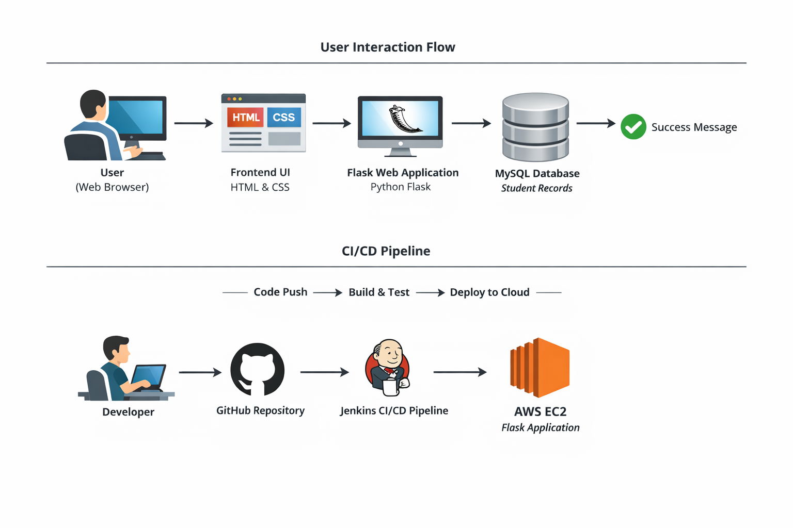
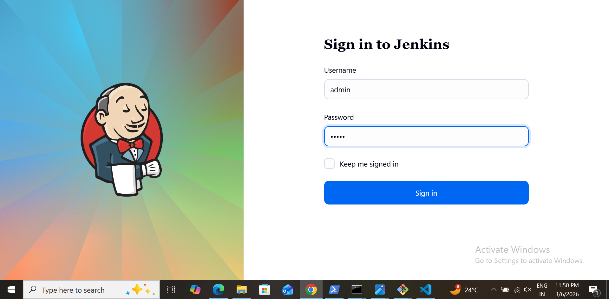
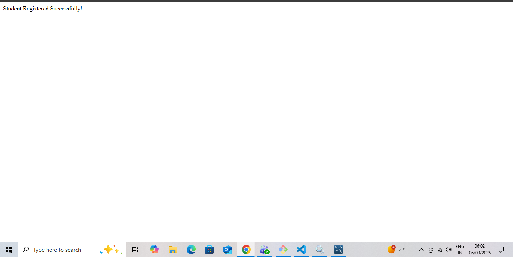
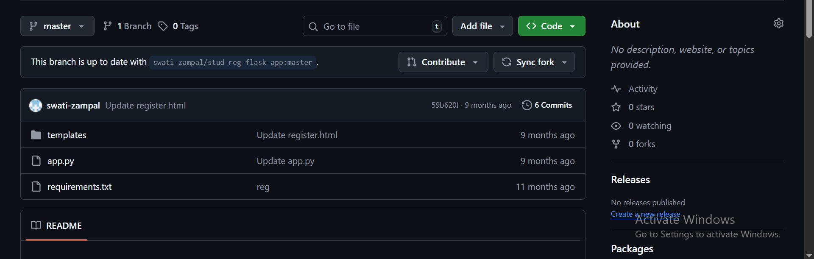
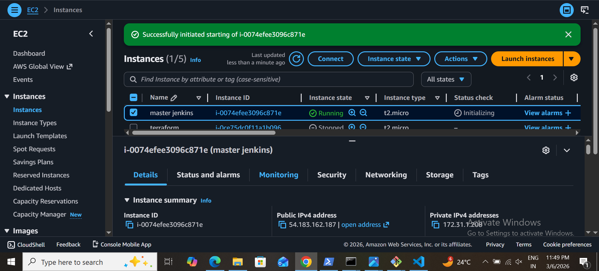

# Flask Based Student Registration Web Application deployed using Jenkins

This project is a Student Registration Web Application built using Python Flask, which allows users to submit student details via a web form. Submitted data is stored in a MySQL database, and a confirmation message is displayed after successful registration.

The project also demonstrates a complete DevOps lifecycle, including Git version control, automated CI/CD using Jenkins, and cloud deployment on AWS EC2.

### Purpose:

- Learn Flask web development and form handling

- Connect Python applications to a MySQL database

- Implement version control and automated deployment

- Deploy applications in a cloud environment

## Architecture Overview

### User Interaction Flow:

     User (Browser)
      │
      ▼
     Frontend (HTML/CSS)
      │
      ▼
     Flask Application (Python)
      │
      ▼
     MySQL Database
     (Student Records)

### Development & Deployment Flow:

       Developer
        │
        ▼
      GitHub Repository
        │
        ▼
      Jenkins Pipeline (CI/CD)
        │
        ▼
      AWS EC2 (Flask App Running)

## Key Features

- Responsive student registration form

-  Validation of form fields

- Persistent storage in MySQL

- Display of success messages after registration

- Version control with Git & GitHub

- Automated build and deployment with Jenkins

- Hosted on AWS EC2

## Technology Stack

| Component       | Technology   |
| --------------- | ------------ |
| Frontend        | HTML, CSS    |
| Backend         | Python Flask |
| Database        | MySQL        |
| Version Control | Git, GitHub  |
| CI/CD           | Jenkins      |
| Cloud Hosting   | AWS EC2      |

## Project Structure

    stud-reg-flask-app/
    │
    ├── app.py                # Main Flask application
    ├── requirements.txt      # Python dependencies
    ├── templates/
    │    └── index.html       # HTML  template for registration form
    ├── screenshots/          # Project   screenshots
    └── README.md             # Project documentation

## Installation Guide

### 1. Clone the repository:
    https://github.com/mansikadam1100/-Flask-Based-Student-Registration-Web-Application-deployed-using-Jenkins.git

### 2. Navigate to project folder:

      cd stud-reg-flask-app

### 3. Create and activate a virtual environment:
#### Windows:
 
        venv\Scripts\activate

#### Linux / Mac:

        source venv/bin/activate
### 4. Install dependencies:

        pip install -r requirements.txt

### 5. Run the application:

      python app.py
### 6. Access the application:
       
         http://137.0.0.1:5000

## Database Setup (MySQL)

     CREATE DATABASE studentsdb;

     USE studentsdb;

     CREATE TABLE students (
     id INT AUTO_INCREMENT PRIMARY KEY,
     name VARCHAR(100),
     email VARCHAR(100),
     phone VARCHAR(20),
     course VARCHAR(50),
     address VARCHAR(255)
    );

## Jenkins CI/CD Pipeline

Workflow:

- Pulls latest code from GitHub

- Installs Python dependencies

- Stops any running Flask instance

- Deploys the application on EC2

### Sample Jenkins script:

    cd /var/lib/jenkins/workspace/flask-student-app
    python3 -m venv venv
    source venv/bin/activate
    pip install -r requirements.txt
    pkill -f app.py || true
    nohup python app.py 

 ### AWS EC2 Deployment Steps

- Launch EC2 instance and SSH into it

- Install Python, pip, Git, and Jenkins

- Configure Jenkins job for CI/CD

- Deploy the Flask application

- Access the application via public IP  

### Access for Jenkins

   http://54.183.162.187:8080/

## Output

### 1. Repository cloned

### 2. Dependencies installed

### 3. Registration form submission success

### 4. GitHub commit history

### 5. EC2 instance setup

### 6. Jenkins job dashboard

### 7. Jenkins build success log

## Learning Outcomes

This project provided hands-on experience with:

- Flask web development and Python backend logic

- Form handling and data validation

- MySQL database integration

- Version control using Git & GitHub

- CI/CD pipeline setup with Jenkins

- Cloud deployment using AWS EC2

## Conclusion

This project demonstrates a complete end-to-end workflow for developing, deploying, and maintaining a cloud-hosted web application. It is ideal for showcasing Python web development skills, DevOps practices, and cloud deployment experience.

## Author

mansi kadam

Aspiring DevOps Engineer | Cloud Computing Enthusiast | CI/CD Learner

Email : mansikadam1100@gmail.com

Github: https://github.com/mansikadam1100

